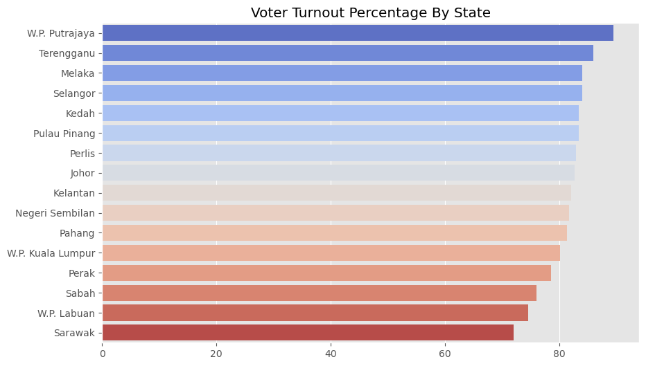

# General Election Data Analysis

This project explores election data of Malaysia across three terms (GE12, GE13, and GE14) using Python with the following libraries:

- `pandas` for data manipulation.
- `matplotlib` and `seaborn` for creating visualizations.

## Data Source
The election dataset used in this project was obtained from https://github.com/Thevesh/data/tree/main/election_malaysia. 100% credit to the author for collating the data from Malaysia Election Commission.

The dataset contains election results for different states and seats. 
Each row represents a seat's election outcome, with columns including total votes, 
majority votes, absentee voters, and spoiled votes.

## Analysis and Visualizations
The following analyses and visualizations were performed:

### 1. States with Top Average Majority by Election Term
- Identified the states with the highest average majority in each election term.
- Visualized results using bar charts, showing the Top 5 in each term.

**📈 Visualization:**

### 2. Distribution of Absent Voters by Election Term:
- Analyzed the distribution of absent voters across different election terms.
- Used box plots to visualize the distribution of absent voters.

**📈 Visualization:**

### 3. Overall Voter Turnout Percentage by Election Term:
- Calculated the overall voter turnout percentage for each election term.
- Displayed the results using line plots or bar charts to show trends in voter turnout.

**📈 Visualization:**

### 4. Voter Turnout Percentage by State:
- Examined the voter turnout percentage for each state.
- Created bar charts to visualize the voter turnout across states.

**📈 Visualization:**

### 5. Seats with Least and Most Rejected Votes:
- Aggregated the rejected vote counts by seat.
- Identified the seats with the least and most rejected votes.

**📈 Visualization:**

### 6. Close Seats and Landslide Seat Analysis:
- Analyzed close and landslide seats based on majority and total votes cast.
- Visualized the distribution of majority using box plots.
- Stacked horizontal bar charts were used to display the count of close and landslide seats per state, and per election term.

**📈 Visualization:**

## Future Improvement

- Include geographical visualizations (`geopandas`) to enhance state-level analysis.
- Add more statistical analysis to identify correlations between various election metrics.
- Implement machine learning models to predict election outcomes or voter turnout.